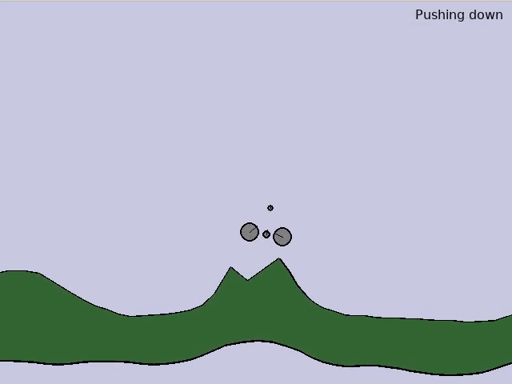
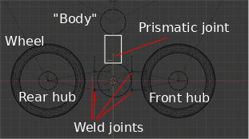

# RL Bike Pumper

This started out as a quick hobby project to see if I could get
a reinforcement agent to learn how to jump high on a bike. But,
tinkering with the physics to get a suitable agent was a pain,
so this turned into to a learning-to-pump-for-speed to clear a
set of obstacles project.



Results video: [https://www.youtube.com/watch?v=p7_XyopoN4w](https://www.youtube.com/watch?v=p7_XyopoN4w).

Box2D is used as the physics engine, and a simple bike
with two wheels, revolute joints for the front and rear hubs that
are welded to a bike (a mass near where the cranks would be).
After fidling with a simple rider with a body, and a head, and several
extra joints (motor and revolute) it was tricky to get something that
was stable in the simulation while also being believable/realistic.

I ended up settling on an even simpler
representation of the bike and rider, where the rider was simply a single
body/fixture that was connected to the bike center with a vertical
prismatic joint.

.

The rider actions are similar to appling a force on the body to move it
up ("Pull up") away from the bike, and a "push down" action that applies
a force downward on the body. Both of these forces are only applicable
when when the prismatic joint connecting the body and bike is not a the limits.


# Bike Model and Terrain Models

The model is built and exported from blender (see [model/model.blend](model/model.blend)).
A JSON version of the bike is loaded from the JSON representation in [model/bike.json](model/bike.json).

# Training an agent

The agent environment is implemented in stable-baselines in [src/pump_env.py](src/pump_env.py)

It consists of some observable state:

* Relative height of front and back wheels (relative to the bike center)
* The vertical distance of a the front-hub to the ground.

And the mapping of actions to forces in the world (plus the simulation with Box2D):


* Pull up (apply an upward force to the body)
* Push down (apply a downward force to the body)
* No-op action (penalized slightly in the reward function)

The training code in [src/pump_env.py](src/train_pump.py) can be invoked with the following command line (trains for 2M iterations):

```
python3 src/train_pump.py --filename=models/model.json --num_train_its=2000000 --save_dir=/tmp/pump_2M --train=1
```
Should result in ep_len_mean > 220 and ep_rew_mean close to zero.

Playing back the results:

```
python3 src/train_pump.py --filename=models/model.json --n_steps=10000 --save_dir=/tmp/pump_2M --train=0
```

## Generalizability

Since the state doesn't involve anything related to the world (or global info
like time), the agent does seem to do the right thing in other similar environments. See the example video above.

## Hard-coded agent

Initially, I was using more observable state (velocity, distance of the prismatic joint, and
some proxy signals of upcoming terrain). However, those signals seemed to be inhibiting the
learning, so the state was stripped down to what was mentioned above. In order to
validate that it was possible to effectively learn with that input signal, I hard-coded an
agent to pull up if the front wheel was above the back wheel, and press down if the back-wheel
was above the front wheel. This agent can be invoked by using "--hard-coded=optimal". While
not actually optimal, you can see that such a strategy does work fairly well.

# A playable version

Use the buttons 'a' to pull up and 'z' to press down. Pretty simple to
make it through the course. Not very fun.

```
python3 src/main.py
```